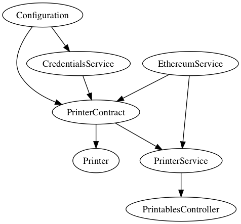

# Init project

    ./init.sh && mvn package

# Run project

    ./run.sh

# Generate contract from submodule

    ./scripts/generate_contract_wrapper.sh

# Docs

# Update class structure

    dot -Tpng docs/classes.gv -o docs/classes.png
